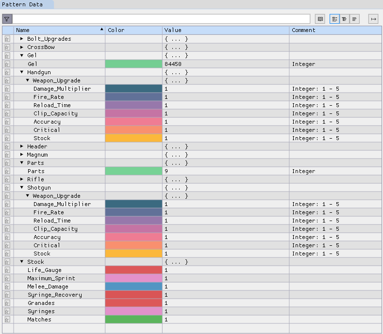

# The Evil Within Saved Game File Checksum Algorithm

Note: Still in development. (Limited) testing with EPIC Store PC Version of TEW1:don't expect this to work with non-PC versions of the game. Always backup your saves before editing or replacing the checksum. Data loss is always a possibility if you do not choose to backup your saves prior to running the scripts or editing the file using ImHex.

History: I wanted to practice the levels I found challenging by using the chapter choice in NG+ before I ran a Akumu + no-upgrades run. However, I needed a way to remove all the upgrades I had from the previous game. Hence this.

## Checksum Calculation Scripts

I would advise using the Powershell script as that does not require the location of the save file to be hardcoded.

- The python scripts assume the file is within a local folder .\savefiles 
- All scripts create a new file with '_modified' appended to the filename. This has the new checksum. Replace the original file with this.

### Python

The python versions (in the Python folder) are the original scripts:

1. savegame-chksm-tew1.py
2. savegame-chksm-tew1-simplified+commented.py

The first was the original, and cleaner. The 2nd script is a simplified version with a lot more commenting, so that in the distant future I can decipher my reasoning.

### Powershell 

In the Powershell_Script folder

The PowerShell script was an experiment how well ChatGPT could convert the python script. It seems to have accomplished this rather well, but after a lot of backwards and forwards. 

I have also added a experimental script to show current death counts (and, as an extra bonus,
what weapon you will be holding when you launch the game.)

## ImHex Editor

You can use the ImHex Hex Editor with the provided Pattern file to edit appropriate areas in the inventory.zwei file. After saving the file, run the checksum script to replace the checksum etc.

Again, this script is very much a work in progress.

### ImHex Editor

- https://github.com/WerWolv/ImHex

